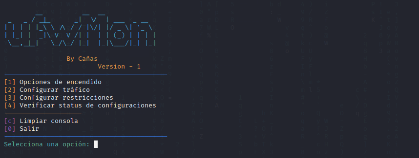

# ufwMon

ufwMon is a complementary tool for the ufw firewall aimed at simplifying its configuration and making it more accessible for users with basic knowledge of Linux.

This tool was designed to reduce the time normally spent configuring ufw and make it simpler and more understandable for those who are not familiar with the complexities of the firewall.

With ufwMon, users can configure and manage the firewall more intuitively and efficiently. Additionally, this tool provides a more visual approach to firewall configuration, making it easier for users to understand.

In summary, ufwMon is a tool that simplifies the configuration of the ufw firewall, making it accessible to any user with basic knowledge of Linux. With this tool, users can manage the firewall more efficiently and in a visually more understandable way.

# Description

The first menu includes options for starting, stopping, and checking the status of the ufw service.

The second menu includes options for configuring ufw traffic, allowing users to block or enable inbound and outbound traffic for both ports and services.

The third menu contains the option to configure restrictions for both inbound traffic and the denial of access to specific IP addresses for a particular port or service.

To clarify further, the first menu provides basic options for managing the ufw service, allowing users to start or stop the firewall and check its status.

The second menu is focused on traffic configuration and provides more granular options for managing inbound and outbound traffic, including the ability to block or allow traffic for specific ports or services.

Finally, the third menu offers advanced configuration options for restricting inbound traffic and denying access to specific IP addresses for a particular port or service.

The last option on the menu allows you to check the current status of the services and restrictions that have been previously configured on the ufw firewall.

This option is important because it allows users to verify whether the configurations made are working correctly and whether the firewall is operating as intended.

When selecting this option, a detailed summary of the current state of the firewall will be displayed, including information on active services and established restrictions. This provides users with a clear and accurate overview of the current state of the firewall, allowing them to take immediate action if something is not working as expected.

In summary, these menus provide a user-friendly interface for configuring and managing the ufw firewall, allowing users to control traffic, set restrictions, and manage the firewall service with ease.

# Update

An additional section has been added that allows for the removal or withdrawal of configurations and restrictions. This section has been implemented with the intention of enabling the elimination of erroneous configurations or accidental actions that may have been made previously.

With this improvement, it is now possible to undo any configuration or restriction that may be causing issues or unnecessary limitations in the system. This will make it easier to correct errors and optimize the system for better performance.

# Upgrade

Various sections of the console user interface have been improved.

Additionally, an issue has been fixed where selecting "Block incoming traffic" previously allowed traffic instead of blocking it. Now, the feature correctly blocks incoming traffic.
